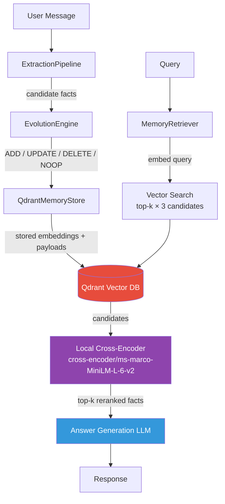
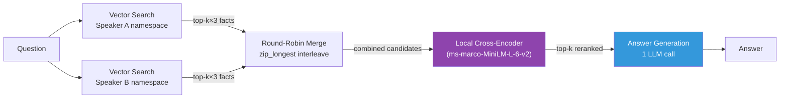

# 🧠 Eidetic Memory

**Long-term memory for AI agents — extracts, evolves, and retrieves facts across conversations.**

<p align="center">
  
  
  
  
  
  
</p>

---

## ✨ Why Eidetic Memory

- 🧠 **Remembers what matters** — extracts atomic facts from every conversation turn, not raw chat logs
- ⚡ **Evolves over time** — ADD, UPDATE, DELETE, NOOP decisions keep memory fresh and conflict-free
- 🎯 **Retrieves the right context** — semantic search + importance reranking surfaces relevant facts at query time
- 🗣️ **Multi-party ready** — per-speaker memory isolation prevents cross-speaker contamination in group conversations
- 🔌 **Any LLM, any time** — swap Claude, Gemini, Azure OpenAI, or Groq with a single env var
- 📊 **Benchmark-validated** — 56.3% QA accuracy on LoCoMo, +39.3 pp on temporal questions over RAG

---

## How It Works

Every conversation turn passes through a four-stage pipeline:



---

## 📊 Evaluation

Evaluated on the [LoCoMo benchmark](https://github.com/snap-research/locomo) across 10 conversations (n=1540 QA pairs) with per-speaker memory isolation.

### Component accuracy

| Metric | Score | Details |
|--------|-------|---------|
| Fact extraction recall | **95.0%** | n=100, QA pairs with evidence |
| Fact extraction precision | **52%** | Relevant facts / total extracted |
| Conflict resolution accuracy | **100%** | 26 test cases (ADD/UPDATE/DELETE/NOOP) |

### Retrieval accuracy (LoCoMo, n=100)

| K | Hit@K |
|---|-------|
| 1 | 11% |
| 5 | 25% |
| 10 | 38% |
| 20 | **56%** |

### End-to-end QA accuracy

| Category | Accuracy |
|----------|----------|
| Temporal | **64.2%** |
| Open-domain | 60.5% |
| Single-hop | 40.1% |
| Multi-hop | 40.6% |
| **Overall** | **56.3%** |

### SOTA Comparison (LoCoMo, LLM-as-judge)

| System | Overall | Temporal | Notes |
|--------|---------|----------|-------|
| RAG baseline (ours) | 44.4% | 24.9% | Direct retrieval over raw turns |
| Pipeline v2 (ours) | 46.6% | 57.3% | Per-speaker isolation + round-robin |
| **Eidetic Memory (ours)** | **56.3%** | **64.2%** | + local cross-encoder (ms-marco-MiniLM-L-6-v2) |
| Mem0 | ~66.9% | — | 3× more LLM calls per query |
| Memobase | 75.78% | 85.05% | — |
| Hindsight (OSS-20B) | 83.18% | 76.32% | — |
| Hindsight (OSS-120B) | 85.67% | 79.44% | — |

### Progress

| Run | Score | Details |
|-----|-------|---------|
| Baseline | 14.8% | Gemini, conv-30 only, top-k=10 |
| + Per-speaker isolation | 31.8% | Multi-namespace retrieval |
| + Fixed merge | 52.4% | Round-robin interleaving |
| + Named entities + two-pass | 53.2% | n=233 |
| + Isolation + RR, no rerank | 25.8% | n=233 — reranker is load-bearing |
| + Isolation + RR + local cross-encoder | 55.8% | n=233 |
| + Isolation + score-based + local cross-encoder | 55.8% | n=233 — merge strategy irrelevant |
| + NER + two-pass + local cross-encoder | 56.6% | n=233 |
| **+ Local cross-encoder (full run)** | **56.3%** | Full n=1540, all 10 convs, v2 judge |

### Retrieval Architecture



---

## 🚀 Reproduce Results

```bash
# 1. Clone and install
git clone https://github.com/CodeNinjaSarthak/eidetic-memory.git
cd eidetic-memory
uv sync --all-packages

# 2. Configure — copy and fill in your API keys
cp .env.development.example .env.development

# 3. Run the benchmark (requires ingested memories)
# Uses ~/eval-venv (sentence-transformers + ONNX); cross-encoder model
# (~66MB) downloads to ~/.cache/huggingface/ on first run.
~/eval-venv/bin/python eval/eval_qa_accuracy.py \
  --conv-ids conv-26 conv-30 conv-41 conv-42 conv-43 conv-44 \
             conv-47 conv-48 conv-49 conv-50 \
  --local-rerank \
  --output eval/results/my_results.json \
  --concurrency 1
```

See [eval/README.md](eval/README.md) for ingestion instructions and full evaluation documentation.

---

## Project Structure

```
eidetic-memory/
├── backend/
│   ├── apps/api/          # FastAPI routes
│   ├── services/          # llm · memory · retrieval · storage
│   └── packages/config/   # Shared settings
├── frontend/              # Next.js chat UI
└── eval/                  # LoCoMo evaluation harness
```

**Dependency graph** (no circular deps):

```
config → storage → llm → retrieval → memory → api
```

---

## Development

```bash
make check   # lint + 152 tests
make run     # start API with hot reload
```

---

## License

[Apache License 2.0](LICENSE)
